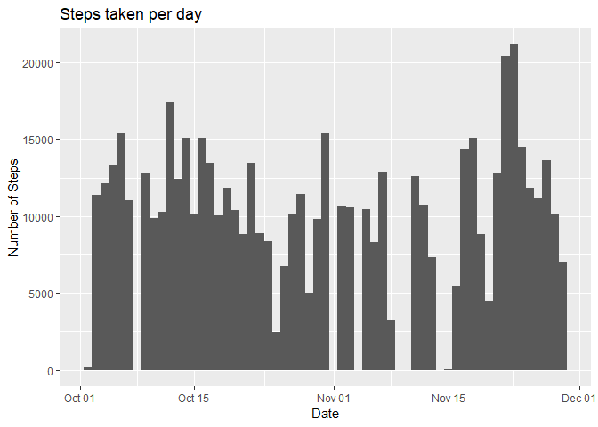
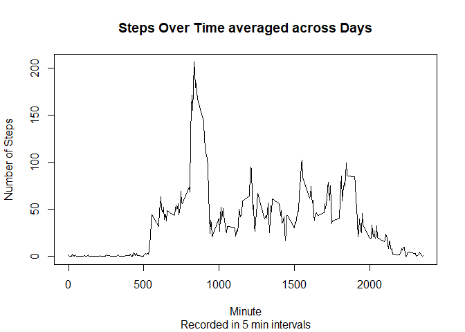

## Loading and preprocessing the data

## What is mean total number of steps taken per day?
<!-- -->
The figure above displays the absolute number of steps recorded each day. The mean number of steps per day is 9354.2295082 while the median number is 10395

## What is the average daily activity pattern?
<!-- -->
  The figure above displays the average number of steps recorded at different times of the day. The largest average number of steps per five minute interval is 206.1698113 recorded at 835

## Imputing missing values
<!-- -->
  The figure above mimics the first figure displayed in this paper with one key difference: missing values have been imputed using the median number of steps recorded at that time of day. This has shifted the mean steps taken per day from 9354.2295082 to 9503.8688525 and the median from 10395 to 10395

## Are there differences in activity patterns between weekdays and weekends?

<!-- -->

